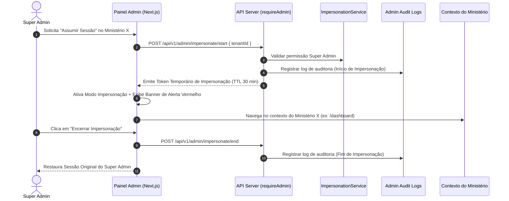

# 11 — Admin Impersonation (Assumir Sessão)

## 📌 Objetivo

O recurso de **Admin Impersonation** (Assumir Sessão) permite que um **Super Admin** da plataforma Gestão Eklésia acesse temporariamente o painel e o contexto operacional de um Ministério / Tenant específico sem solicitar ou conhecer a senha do cliente.

Esta funcionalidade é destinada a:
- Atendimento de suporte técnico avançado de Nível 3;
- Reprodução e diagnóstico de chamados reportados pelo cliente em ambiente produtivo;
- Auxílio guiado em configurações de onboarding e homologação de módulos.

---

## 🔄 Fluxo de Funcionamento



1. **Início:** O Super Admin autoriza a impersonação no cadastro do cliente em `/admin/ministerios/[id]`.
2. **Emissão do Token:** O servidor valida os privilégios do operador e gera uma credencial assinada e temporária contendo a dupla identidade (`originalAdminId` e `targetTenantId`).
3. **Navegação Interceptada:** Todas as chamadas subsequentes via `authenticatedFetch` passam a enviar os cabeçalhos de impersonação.
4. **Visual Alerta:** O frontend exibe uma barra de topo vermelha e destacada (*"Modo Impersonação Ativo: Ministério X [Sair]"*).
5. **Encerramento:** Ao clicar em "Encerrar Impersonação" ou atingir a expiração por timeout, a sessão do tenant é destruída e o operador retorna imediatamente ao perfil nativo de Super Admin.

---

## 🛡️ Diretrizes de Segurança

- **Acesso Restrito:** Apenas usuários com a role `super_admin` ou `admin` autorizados podem iniciar a impersonação.
- **Não-exposição de Senhas:** Nenhuma credencial ou hash de senha do cliente é lido, alterado ou compartilhado durante o processo.
- **Assinatura Criptográfica:** O token de impersonação é assinado via JWT / HMAC com segredo do servidor e não pode ser forjado pelo cliente.

---

## 📜 Auditoria Rígida (`admin_audit_logs`)

Toda ação de impersonação é auditada e gravada de forma compulsória e indelével na tabela `admin_audit_logs`.

### Estrutura do Log de Auditoria
```json
{
  "action": "IMPERSONATION_START",
  "operator_admin_id": "00000000-0000-0000-0000-000000000001",
  "operator_admin_email": "admin@gestaoeklesia.com.br",
  "impersonated_tenant_id": "08c3fa94-b737-4a5f-98aa-836ae735eeee",
  "impersonated_tenant_name": "BARCARENA",
  "ip_address": "189.X.X.X",
  "started_at": "2026-07-23T13:30:00.000Z",
  "status": "success"
}
```

Toda mutação executada durante a impersonação (criação de registros, alterações em membros ou relatórios) armazena a dupla identidade: **Operador Real** + **Tenant Alvo**.

---

## ⏳ Expiração e Invalidação

- **Duração Máxima (TTL):** 30 minutos por padrão.
- **Renovação Automática:** **PROIBIDA**. O token expira automaticamente e exige um novo acionamento manual se o atendimento se estender.
- **Revogação Imediata:** O token pode ser revogado a qualquer momento via rota `/api/v1/admin/impersonate/end` ou caso a sessão do Super Admin seja encerrada.

---

## 🚫 Restrições Operacionais durante a Impersonação

Durante a vigência do modo de impersonação, o sistema bloqueia automaticamente as seguintes ações destrutivas ou de alteração de propriedade:

1. ❌ Alterar e-mail principal ou senha de acesso do proprietário do ministério.
2. ❌ Excluir fisicamente o ministério/cliente da plataforma.
3. ❌ Transferir titularidade de assinatura ou alterar cartões de crédito cadastrados.
4. ❌ Alterar configurações de chaves de gateway de pagamento do cliente.
