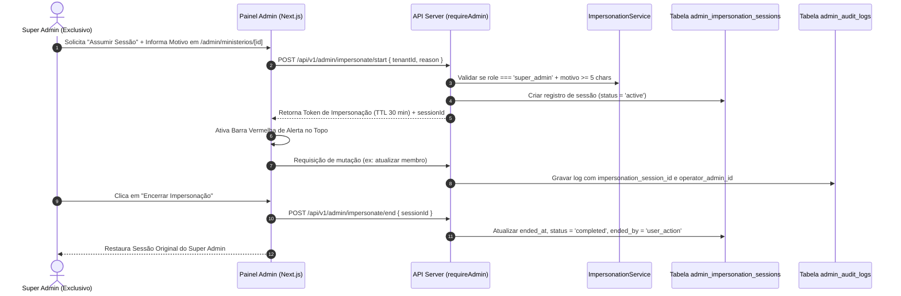

# 11 — Admin Impersonation (Assumir Sessão)

## 📌 Objetivo

O recurso de **Admin Impersonation** (Assumir Sessão) permite que um **Super Admin** da plataforma Gestão Eklésia acesse temporariamente o painel e o contexto operacional de um Ministério / Tenant específico sem solicitar ou conhecer a senha do cliente.

Esta funcionalidade é destinada a:
- Atendimento de suporte técnico avançado de Nível 3;
- Reprodução e diagnóstico de chamados de alta complexidade reportados pelo cliente em ambiente produtivo;
- Auxílio guiado em configurações de onboarding e homologação de módulos.

---

## 🔒 Matriz Oficial de Permissões (AJUSTE 01)

A permissão para iniciar uma sessão de impersonação é **estritamente restrita ao perfil SUPER_ADMIN**. Perfis operacionais ou administrativos comuns não possuem acesso a esta funcionalidade em nenhuma hipótese.

| Perfil (`AdminRole`) | Permissão de Impersonação | Justificativa de Segurança |
| :--- | :---: | :--- |
| **`SUPER_ADMIN`** | **✓ Autorizado** | Responsável máximo pela infraestrutura e suporte Nível 3. |
| **`ADMIN`** | **✗ Não autorizado** | Impedido para evitar acessos cruzados não auditados por administradores gerais. |
| **`FINANCEIRO`** | **✗ Não autorizado** | Perfil operacional restrito a cobranças e relatórios financeiros. |
| **`SUPORTE`** | **✗ Não autorizado** | Perfil de atendimento via chamados padrão sem elevação de privilégios. |
| **`COMERCIAL`** | **✗ Não autorizado** | Perfil focado em negociações e funil de vendas. |

---

## 📊 Auditoria Especializada — Tabela `admin_impersonation_sessions` (AJUSTE 02)

Para garantir auditoria jurídica inquestionável, a plataforma **não utiliza apenas a tabela genérica de logs**. O ciclo de vida de cada impersonação é registrado em uma tabela dedicada de controle: **`admin_impersonation_sessions`**.

### Schema DDL da Tabela `admin_impersonation_sessions`

```sql
CREATE TABLE IF NOT EXISTS admin_impersonation_sessions (
  id UUID PRIMARY KEY DEFAULT gen_random_uuid(),
  admin_id UUID NOT NULL REFERENCES admin_users(id),
  tenant_id UUID NOT NULL REFERENCES ministries(id),
  started_at TIMESTAMPTZ NOT NULL DEFAULT NOW(),
  ended_at TIMESTAMPTZ,
  ended_by VARCHAR(50) CHECK (ended_by IN ('user_action', 'timeout', 'security_revocation')),
  reason TEXT NOT NULL,
  read_only BOOLEAN NOT NULL DEFAULT FALSE,
  ip VARCHAR(45) NOT NULL,
  user_agent TEXT NOT NULL,
  jwt_id VARCHAR(255) NOT NULL,
  status VARCHAR(20) NOT NULL CHECK (status IN ('active', 'completed', 'expired', 'revoked')) DEFAULT 'active'
);

-- Índice de alta performance para buscar sessões ativas do admin
CREATE INDEX IF NOT EXISTS idx_impersonation_admin_status ON admin_impersonation_sessions(admin_id, status);
CREATE INDEX IF NOT EXISTS idx_impersonation_tenant ON admin_impersonation_sessions(tenant_id);
```

### Relação com `admin_audit_logs` (Rastreabilidade 360°)

1. **Registro Mestre da Sessão:** Cada início e término de impersonação gera **exatamente um registro mestre** em `admin_impersonation_sessions`.
2. **Vínculo das Mutações:** Todas as alterações administrativas realizadas no sistema durante a vigência da impersonação (ex: edições em membros, faturas ou parâmetros) gravam obrigatoriamente a coluna `impersonation_session_id` na tabela `admin_audit_logs`.

Dessa forma, a auditoria permite responder com 100% de precisão:
- **Quem** iniciou a sessão (`admin_id` do Super Admin Real);
- **Qual** tenant foi acessado (`tenant_id` do Ministério Alvo);
- **Quanto tempo** a sessão permaneceu aberta (`started_at` até `ended_at`);
- **Qual o motivo** do acesso (`reason` preenchido obrigatoriamente);
- **Todas as alterações pontuais** executadas durante aquele atendimento específico via `admin_audit_logs`.

---

## 🔄 Fluxo de Funcionamento Arquitetural



---

## 🛡️ Diretrizes Globais de Segurança

- **Exclusividade Estrita:** Apenas o perfil `super_admin` pode invocar `ImpersonationService.startImpersonation()`.
- **Justificativa Compulsória:** O campo `reason` é obrigatório com no mínimo 5 caracteres descrevendo o chamado ou ticket associado.
- **Não-exposição de Senhas:** Nenhuma credencial ou hash de senha do cliente é lido, alterado ou compartilhado durante o processo.
- **Assinatura Criptográfica:** O token de impersonação é assinado via JWT / HMAC com segredo do servidor e id único (`jwt_id`).

---

## ⏳ Expiração e Invalidação

- **Duração Máxima (TTL):** 30 minutos por padrão.
- **Renovação Automática:** **PROIBIDA**. O token expira automaticamente e exige um novo acionamento manual se o atendimento se estender.
- **Encerramento Controlado:** Ao expirar, a sessão registra `ended_by = 'timeout'` e `status = 'expired'`.

---

## 🚫 Restrições Operacionais durante a Impersonação

Durante a vigência do modo de impersonação, a API bloqueia automaticamente as seguintes ações destrutivas:

1. ❌ Alterar e-mail principal ou senha de acesso do proprietário do ministério.
2. ❌ Excluir fisicamente o ministério/cliente da plataforma.
3. ❌ Transferir titularidade de assinatura ou alterar cartões de crédito cadastrados.
4. ❌ Alterar configurações de chaves de gateway de pagamento do cliente.
